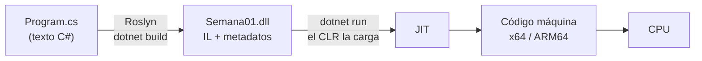

> Relacionadas: cubre la brecha "Fundamentos de C# y .NET" de [[02 Contexto y perfil]] · se lee al inicio de cada día de código del [[04 Calendario dia por dia]] · se apoya en el nivel 0 del [[05 Arbol de fundamentos]] (bits, bytes, memoria) · términos nuevos a [[08 Glosario]] · decisiones en [[01 Bitacora]]

# Teoría de C#

El [[05 Arbol de fundamentos]] explica la computadora y la web, pero no el lenguaje. Esta nota es la teoría de C# y .NET que necesitas **antes** de escribir el código de cada día. No cambia las horas de la semana: los primeros 20 minutos de cada sesión de código (martes a jueves) son lectura de la sección del día; el resto es teclado.

**Regla del plan:** aquí hay ejemplos cortos para entender cada concepto, pero no las soluciones de los ejercicios. Esos los escribes tú.

## Cómo usar esta nota

| Día | Lectura (20 min) | Código (70 min) |
| --- | --- | --- |
| Mar 6 oct | 1. Qué es .NET · 2. Anatomía de un proyecto · 3. Tipos | Primer proyecto por CLI, tipos, desbordamiento |
| Mié 7 oct | 4. Control de flujo · 5. `double` vs. `decimal` | Ciclos y tabla de pagos |
| Jue 8 oct | 6. Métodos · 7. Convenciones | `CalcularInteres` y commit de los 5 ejercicios |

Al terminar cada sección, contesta en voz alta sus preguntas de repaso sin mirar. Si no puedes, vuelve a leerla antes de programar.

---

## 1. Qué es .NET y cómo corre tu código

Tres cosas distintas que se confunden en entrevistas:

| Término | Qué es | Analogía |
| --- | --- | --- |
| **C#** | El lenguaje: la sintaxis y las reglas que escribes | El idioma |
| **.NET** | La plataforma: runtime + bibliotecas + herramientas | El país donde se habla |
| **CLR** (Common Language Runtime) | El motor que ejecuta tu programa: carga el código, administra la memoria, maneja excepciones | El intérprete en tiempo real |

En el plan usas **.NET 10 (LTS)**, que trae **C# 14**. LTS significa soporte de 3 años; las versiones pares son LTS y las impares duran 18 meses.

### SDK vs. runtime

- **Runtime:** lo mínimo para *ejecutar* apps .NET. Es lo que tendría un servidor de producción.
- **SDK:** runtime + compilador + el comando `dotnet` + plantillas. Es lo que necesitas para *desarrollar*. `dotnet --list-sdks` muestra los que tienes.

### De texto a instrucciones de CPU



1. **Compilación (`dotnet build`):** el compilador de C#, llamado **Roslyn**, revisa tipos y sintaxis y traduce tu código a **IL** (Intermediate Language), un lenguaje intermedio que no depende del procesador. El resultado es un **ensamblado** (`.dll`) con el IL y **metadatos** (qué clases y métodos existen).
2. **Ejecución:** el CLR carga el ensamblado. La primera vez que se llama cada método, el **JIT** (Just-In-Time compiler) lo traduce de IL a código máquina del procesador real. Las siguientes llamadas usan ese código ya traducido.
3. Mientras corre, el CLR administra la memoria: el **recolector de basura** (GC) libera los objetos que ya nadie usa. Por eso a C# se le llama **código administrado** (managed code).

**Por qué importa:** el IL es la razón por la que la misma `.dll` corre en Windows, Linux y Mac. Y explica por qué la primera petición a una API .NET es más lenta que las demás (el JIT está trabajando). La semana 2 (nivel 0.4 del árbol) profundiza en stack, heap y GC.

### Bibliotecas

- **BCL** (Base Class Library): lo que ya viene con .NET: `Console`, `Math`, `string`, `List<T>`, `DateTime`, `HttpClient`…
- **NuGet:** el gestor de paquetes de .NET, como npm en JavaScript. Lo usarás en la semana 8 con `Google.Apis.Calendar.v3`.

**Preguntas de repaso**
- ¿Qué diferencia hay entre C#, .NET y el CLR?
- ¿Qué contiene una `.dll` de .NET y por qué no es código máquina?
- ¿Qué hace el JIT y cuándo?
- ¿Para qué necesitas el SDK si ya tienes el runtime?

---

## 2. Anatomía de un proyecto

`dotnet new console -n Semana01` crea una carpeta con dos archivos:

**`Semana01.csproj`**: la receta del proyecto, en XML.

```xml
<Project Sdk="Microsoft.NET.Sdk">
  <PropertyGroup>
    <OutputType>Exe</OutputType>
    <TargetFramework>net10.0</TargetFramework>
    <ImplicitUsings>enable</ImplicitUsings>
    <Nullable>enable</Nullable>
  </PropertyGroup>
</Project>
```

| Línea | Qué significa |
| --- | --- |
| `Sdk="Microsoft.NET.Sdk"` | Tipo de proyecto. Una API usa `Microsoft.NET.Sdk.Web` |
| `OutputType` `Exe` | Genera un ejecutable; una biblioteca sería `Library` |
| `TargetFramework` `net10.0` | Versión de .NET contra la que compila (el TFM) |
| `ImplicitUsings` | Agrega solo los `using` comunes (`System`, `System.IO`, `System.Linq`…) |
| `Nullable` | Activa las advertencias de nulos; lo verás a fondo en la semana 4 |

En .NET Framework (lo que usas en DiSí) el `.csproj` listaba cada archivo y tenía cientos de líneas. En .NET moderno es "estilo SDK": incluye todos los `.cs` de la carpeta automáticamente.

**`Program.cs`**: una sola línea, `Console.WriteLine("Hello, World!");`. Son **top-level statements** (instrucciones de nivel superior): el compilador genera por ti la clase `Program` y el método `Main`, que es el **punto de entrada**. Un proyecto solo puede tener un archivo con top-level statements.

### Carpetas `bin` y `obj`

- **`obj/`**: archivos intermedios de la compilación (por ejemplo, `project.assets.json` con los paquetes resueltos). No se toca.
- **`bin/Debug/net10.0/`**: el resultado:
  - `Semana01.dll`: tu programa en IL.
  - `Semana01.exe`: un lanzador pequeño (apphost) que arranca el runtime y carga la `.dll`.
  - `Semana01.runtimeconfig.json`: qué versión del runtime necesita.
  - `Semana01.pdb`: símbolos de depuración (une el IL con tus líneas de código).

`bin` y `obj` **nunca van a Git**: se regeneran con cada build. `dotnet new gitignore` crea el `.gitignore` correcto en la raíz del repo.

**Debug vs. Release:** `dotnet build` compila en Debug (sin optimizar, fácil de depurar). `dotnet build -c Release` optimiza; es lo que va a producción.

### Comandos del día

| Comando | Qué hace |
| --- | --- |
| `dotnet --list-sdks` | SDKs instalados |
| `dotnet new console -n Nombre` | Proyecto nuevo de consola en la carpeta `Nombre` |
| `dotnet build` | Compila (Roslyn → IL en `bin/`) |
| `dotnet run` | Compila si hace falta y ejecuta |
| `dotnet clean` | Borra lo compilado |
| `dotnet new sln` y `dotnet sln add Semana01` | Crea una solución y le agrega el proyecto, para abrir todo `plan-dotnet` junto en Visual Studio |

**Preguntas de repaso**
- ¿Qué genera el compilador a partir de los top-level statements?
- ¿Qué hay en `bin` y qué hay en `obj`? ¿Por qué no se suben a Git?
- ¿Qué cambia entre un `.csproj` de .NET Framework y uno de .NET 10?

---

## 3. Variables y el sistema de tipos

C# es **estáticamente tipado**: cada variable tiene un tipo fijo que el compilador conoce antes de ejecutar. Y es **fuertemente tipado**: no mezcla tipos sin que se lo pidas. Muchos errores que en JavaScript aparecen en producción, en C# no compilan.

```csharp
int plazo = 12;          // declaración con tipo explícito
var tasa = 0.24m;        // var: el compilador infiere decimal; sigue siendo estático
const int MesesPorAnio = 12;   // constante: se resuelve al compilar
```

`var` no es "tipo dinámico": el tipo se fija en la primera asignación y ya no cambia.

### Tipos básicos

Conecta con el lunes (0.1 Datos): cada tipo es una cantidad fija de bytes.

| Tipo C# | Tipo .NET | Tamaño | Rango o precisión | Uso típico |
| --- | --- | --- | --- | --- |
| `int` | `System.Int32` | 4 bytes | −2,147,483,648 a 2,147,483,647 | Contadores, plazos, IDs |
| `long` | `System.Int64` | 8 bytes | ±9.2 × 10¹⁸ | IDs grandes, ticks de tiempo |
| `double` | `System.Double` | 8 bytes | ~15–17 dígitos, binario | Ciencia, gráficas, `Math.Pow` |
| `decimal` | `System.Decimal` | 16 bytes | 28–29 dígitos, base 10 | **Dinero** |
| `bool` | `System.Boolean` | 1 byte | `true` / `false` | Condiciones |
| `char` | `System.Char` | 2 bytes | Un carácter UTF-16 | Letras sueltas |
| `string` | `System.String` | Variable | Texto inmutable | Texto |

`int` es solo un **alias** de `System.Int32`: son exactamente el mismo tipo. Por eso existe `int.MaxValue` (es `Int32.MaxValue`).

Todos son **tipos por valor** (la variable guarda el dato) excepto `string`, que es **por referencia** (la variable guarda la dirección del texto). La semana 2 explica la diferencia en memoria. `string` además es **inmutable**: cada "modificación" crea un string nuevo.

### Literales

| Escribes | Tipo |
| --- | --- |
| `100` | `int` |
| `100L` | `long` |
| `1.5` | `double` (sin sufijo, un decimal es `double`) |
| `1.5m` | `decimal` (la `m` es de *money*) |
| `1_000_000` | `int`; el guion bajo solo ayuda a leer |
| `0xFF`, `0b1010` | Hexadecimal y binario, como en tu clase del lunes |
| `'A'` / `"A"` | `char` / `string` |

### Conversiones

- **Implícita** (segura, sin perder datos): de `int` a `long`, de `int` a `double`. El compilador la hace solo.
- **Explícita o cast** (puede perder datos): de `double` a `int` corta los decimales; de `long` a `int` puede no caber. Tienes que pedirla: `(int)valor`.
- **Desde texto:** `int.Parse("12")` lanza una excepción si el texto no es número. `int.TryParse(texto, out int n)` devuelve `true` o `false` sin lanzar nada; es lo correcto para datos que escribe un usuario.

### Desbordamiento (overflow)

Si sumas 1 a `int.MaxValue`, el valor no cabe en 4 bytes. Por defecto C# **no avisa**: los bits "dan la vuelta" y obtienes el número más negativo. Se llama **complemento a dos** y es la misma aritmética binaria del lunes.

- Dentro de un bloque o expresión `checked`, el mismo desbordamiento lanza una `OverflowException`.
- `unchecked` es el comportamiento por defecto.
- **Trampa:** si toda la operación son constantes conocidas al compilar, el compilador detecta el desbordamiento y **no compila**. Para verlo en ejecución, el valor tiene que pasar por una variable.

En DiSí esto importa: un monto que desborda en silencio es un error de cartera que nadie ve.

### Texto con formato

```csharp
string nombre = "Alex";
decimal saldo = 15250.5m;
Console.WriteLine($"Hola {nombre}, tu saldo es {saldo:N2}");   // interpolación con formato
```

`:N2` agrega separador de miles y 2 decimales; `:C` usa el símbolo de moneda de la **cultura** de la máquina. La cultura cambia comas y puntos según el país, así que no la des por hecha.

**Preguntas de repaso**
- ¿`var` hace que C# sea dinámico? ¿Por qué no?
- ¿Cuántos bytes ocupa un `int` y por qué su máximo es 2,147,483,647?
- ¿Qué pasa al sumar 1 a `int.MaxValue` con y sin `checked`?
- ¿Cuándo usarías `Parse` y cuándo `TryParse`?

---

## 4. Control de flujo

Una **expresión** produce un valor (`monto * tasa`); una **instrucción** ejecuta una acción (`if`, `for`, una asignación).

### Operadores

| Tipo | Operadores | Nota |
| --- | --- | --- |
| Comparación | `==` `!=` `<` `>` `<=` `>=` | Devuelven `bool` |
| Lógicos | `&&` `\|\|` `!` | `&&` y `\|\|` son de **cortocircuito**: si la izquierda ya decide, la derecha no se evalúa |
| Ternario | `condicion ? a : b` | Un `if` que produce un valor |
| Aritméticos | `+` `-` `*` `/` `%` | Entre dos `int`, `/` **descarta los decimales**: `7 / 2` da `3` |

El cortocircuito sirve para proteger: en `cliente != null && cliente.Activo`, si `cliente` es nulo nunca se evalúa `cliente.Activo`.

### Decisiones

- **`if / else if / else`:** para condiciones generales.
- **`switch` (instrucción):** para elegir entre valores fijos. Cada `case` termina en `break`.
- **`switch` expresión** (C# 8+): produce un valor y admite patrones.

```csharp
string nivel = score switch
{
    >= 700 => "Bajo riesgo",
    >= 600 => "Riesgo medio",
    _      => "Alto riesgo"     // _ es "cualquier otro caso"
};
```

Esos `>= 700` son **patrones relacionales**. Así se ven las reglas de dictaminación en C# moderno.

### Ciclos

| Ciclo | Cuándo |
| --- | --- |
| `for` | Sabes cuántas vueltas: un plazo de 12 meses |
| `while` | Repites mientras se cumpla una condición, y puede que nunca entre |
| `do / while` | Igual, pero entra al menos una vez (por ejemplo, pedir un dato hasta que sea válido) |
| `foreach` | Recorres cada elemento de una colección o un string |

`break` sale del ciclo; `continue` salta a la siguiente vuelta. Una variable declarada dentro de un bloque `{ }` solo existe dentro de él: es su **ámbito** (scope).

**Preguntas de repaso**
- ¿Qué es el cortocircuito y para qué te sirve?
- ¿Cuánto da `7 / 2` y cómo obtienes `3.5`?
- ¿Cuándo eliges `while` y cuándo `do / while`?

---

## 5. `double` vs. `decimal`: por qué el dinero va en `decimal`

`double` guarda los números en **binario**. Igual que 1/3 no se puede escribir exacto en decimal (0.3333…), 0.1 no se puede escribir exacto en binario: queda como 0.1000000000000000055… Al sumar esas pequeñas diferencias, `0.1 + 0.2` no da exactamente `0.3`. Es el estándar **IEEE 754** y pasa en casi todos los lenguajes, JavaScript incluido.

`decimal` guarda los números en **base 10**, así que 0.1 es exactamente 0.1. Es más lento y ocupa el doble, pero en dinero un centavo de diferencia en 10,000 créditos es un descuadre.

| | `double` | `decimal` |
| --- | --- | --- |
| Base | 2 | 10 |
| Precisión | ~15–17 dígitos | 28–29 dígitos |
| `0.1 + 0.2 == 0.3` | `false` | `true` |
| Dividir entre cero | Da `Infinity` | Lanza `DivideByZeroException` |
| Uso | Medidas, ciencia, gráficas | Montos, tasas, intereses |

**Para la tabla de pagos del miércoles:**

- La cuota fija de un crédito (sistema francés) es `cuota = P · i / (1 − (1 + i)^−n)`, donde `P` es el monto, `i` la tasa **mensual** (anual / 12) y `n` el número de meses. Cada mes, interés = saldo × i; abono a capital = cuota − interés; nuevo saldo = saldo − abono.
- `Math.Pow` solo trabaja con `double`. Tendrás que decidir dónde convertir entre `double` y `decimal`, y justificarlo.
- **Redondeo:** `Math.Round(x, 2)` usa por defecto el *redondeo bancario* (`MidpointRounding.ToEven`): 2.125 → 2.12. Muchos sistemas financieros esperan `MidpointRounding.AwayFromZero`: 2.125 → 2.13. Averigua cuál usa DiSí; es una gran pregunta de entrevista.

**Preguntas de repaso**
- ¿Por qué `0.1 + 0.2` no da `0.3` con `double`?
- ¿Qué ganas y qué pierdes al usar `decimal`?
- ¿Qué es el redondeo bancario?

---

## 6. Métodos

Un método es un bloque de código con nombre que recibe datos, hace algo y opcionalmente devuelve un resultado. Sirve para no repetir código y para que cada pieza tenga una sola responsabilidad.

### Firma

```csharp
static string Saludar(string nombre, bool formal = false)
{
    return formal ? $"Buen día, {nombre}" : $"Hola, {nombre}";
}
```

| Parte | En el ejemplo | Qué es |
| --- | --- | --- |
| Modificador | `static` | Pertenece al tipo, no a un objeto. Por ahora todos tus métodos serán `static`; en la semana 2 verás por qué |
| Tipo de retorno | `string` | Lo que devuelve; `void` si no devuelve nada |
| Nombre | `Saludar` | PascalCase, con un verbo |
| Parámetros | `string nombre, bool formal = false` | Datos de entrada, cada uno con su tipo |

- **Parámetro opcional:** `formal = false` tiene un valor por defecto; puedes llamar a `Saludar("Alex")`.
- **Argumento con nombre:** `Saludar(nombre: "Alex", formal: true)` hace legible una llamada con muchos parámetros.
- **Paso por valor:** el método recibe una **copia** del valor. Si cambia un parámetro `int`, la variable de quien lo llamó no cambia. `ref`, `out` e `in` cambian eso; ya usaste `out` en `TryParse`.
- **Cuerpo de expresión:** si el método es una sola expresión, puedes escribir `=> expresion;` en lugar de `{ return expresion; }`.

### Dónde viven los métodos con top-level statements

En `Program.cs` con top-level statements puedes declarar **funciones locales** debajo del código principal. Cuando el archivo crezca, lo normal es moverlas a una clase `static` propia en otro archivo, por ejemplo `Calculadora.cs`.

### Sobrecarga (overloading)

Varios métodos con el **mismo nombre** y **distinta lista de parámetros** (distinto número, tipo u orden). El compilador elige cuál llamar según los argumentos. El tipo de retorno **no** cuenta para distinguirlos. `Console.WriteLine` tiene más de 15 sobrecargas: una para `int`, otra para `string`, otra para `decimal`…

**Preguntas de repaso**
- ¿Qué partes tiene la firma de un método?
- ¿Por qué cambiar un parámetro `int` dentro de un método no cambia la variable original?
- ¿Puedes tener dos métodos que solo difieran en el tipo de retorno? ¿Por qué?

---

## 7. Convenciones de estilo

Un reclutador lee tu código antes que tu CV. Estas son las de Microsoft:

| Qué | Convención | Ejemplo |
| --- | --- | --- |
| Clases, métodos, propiedades, constantes | PascalCase | `CalcularInteres`, `MesesPorAnio` |
| Variables locales y parámetros | camelCase | `tasaAnual`, `montoTotal` |
| Campos privados | `_camelCase` | `_saldo` |
| Interfaces | `I` + PascalCase | `ICredito` (semana 3) |
| Llaves | En su propia línea (estilo Allman) | |
| Nombres | Que digan qué son, sin abreviar | `tasaMensual`, no `tm` |

---

## Preguntas de cierre de la semana

Contéstalas en voz alta, en menos de un minuto cada una, el domingo en la revisión:

1. Explica qué pasa desde que escribes `dotnet run` hasta que la CPU ejecuta tu código.
2. ¿Qué diferencia hay entre el SDK y el runtime?
3. ¿Qué es un ensamblado y qué contiene?
4. ¿Por qué el dinero se maneja en `decimal` y no en `double`?
5. ¿Qué pasa cuando un `int` se desborda y cómo lo detectas?
6. ¿Qué es la sobrecarga de métodos?

## Glosario de la semana

Pasa estos términos a [[08 Glosario]] con tu propia definición y un ejemplo de DiSí: CLR, IL, JIT, ensamblado, SDK, runtime, BCL, NuGet, top-level statements, punto de entrada, tipo por valor, tipo por referencia, inmutable, cast, overflow, `checked`, IEEE 754, redondeo bancario, cortocircuito, ámbito, firma, sobrecarga.

## Lo que viene

Cada sección se agrega aquí antes de que empiece su semana:

| Semana | Teoría de C# |
| --- | --- |
| 2 | Clases y objetos, constructores, propiedades, valor vs. referencia, `struct`, `record` |
| 3 | Interfaces, herencia, polimorfismo, clases abstractas, colecciones (`List<T>`, `Dictionary<K,V>`), genéricos |
| 4 | LINQ, excepciones (`try/catch/finally`, excepciones propias), tipos que aceptan nulos |
| 5 | `async/await`, `Task`, `HttpClient`, JSON con `System.Text.Json` |

## Recursos

- Tour de C#: https://learn.microsoft.com/dotnet/csharp/tour-of-csharp/
- Tipos integrados: https://learn.microsoft.com/dotnet/csharp/language-reference/builtin-types/built-in-types
- Comando `dotnet`: https://learn.microsoft.com/dotnet/core/tools/
- Convenciones de código: https://learn.microsoft.com/dotnet/csharp/fundamentals/coding-style/coding-conventions
